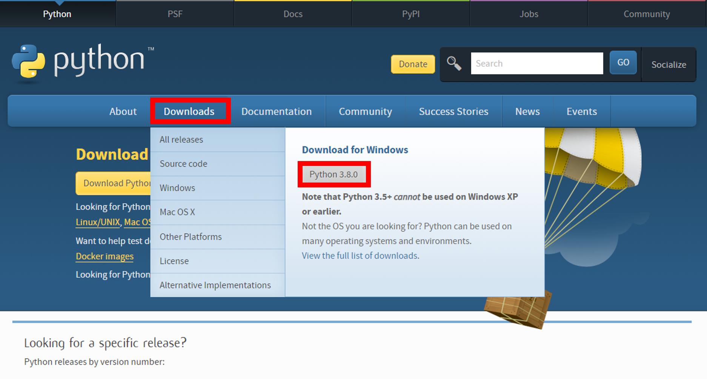
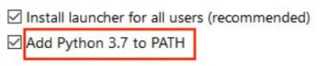

# Python

## 개발 환경 셋팅
---
### 설치

http://www.python.org/downloads 에서 다운로드  
현재(2019.10.30 기준) 3.8.0 (stable)까지 나와 있음  

> PATH 잡아서 설치 하기
---

### pip
Python Package Index(PyPI)에서 제공하는 Python Package를 설치, 관리하는 시스템

```
windows: python -m pip install -U pip 혹은 https://www.lfd.uci.edu/~gohlke/pythonlibs/#pip/
centos: yum install pip
ubuntu: apt-get install python-pip
```
#### 사용법

```bash
# 사용법
pip <pip arguments> 
python -m pip <pip arguments>
```
##### pip 간단한 옵션들
``` bash
# 패키지 설치
pip install <package>
## windows에서 다운로드가 잘 안될 경우
## pip --trusted-host pypi.org --trusted-host files.pythonhosted.org install <package>

# 설치된 패키지 리스트 보기
pip list

# 설치된 패키지를 requirements format으로 출력하기
pip freeze > requirements.txt
# requirements에 있는 패키지 설치하기
pip install -r requirements.txt

# 설치된 패키지의 구체적인 정보 보기
pip show <package>

# 특정 패키지 찾기
pip search <package>

# 패키지 삭제
pip uninstall <package>

# 패키지 dependency check
pip check

# Online 되는 곳에서 해당 패키지를 다운 로드 받음
pip download <package>
# Offline 인 곳에 다운로드 받은 패키지를 옮겨 아래와 같이 실행하여 설치
pip install --no-index --find-links . <package>
```
> https://pip.pypa.io/en/stable/

---

### 가상 환경 구성
virtualenv 혹은 venv(3.4 이후는 기본 설치) 사용  
* 가상 환경을 구축하여 서로 다른 응용 프로그램간의 영향을 주지 않게 할 수 있음  
(해당 용용 프로그램에 필요한 파이썬이나 패키지를 설치한 데이터 트리를 구성하는 방법)
> https://virtualenv.pypa.io/en/latest/  
> https://docs.python.org/3/library/venv.html#


#### 설치 (3.5 이상 설치 불필요)
```bash
pip install virtualenv
```
#### 사용법
```bash
# Linux
## 환경 구성
virtualenv ENV
python -m venv .venv
## 동작
source .venv/bin/activate
## 종료
deactivate
```
```powershell
# Windows
## 환경 구성 
python -m venv .venv
## 동작
. .venv\Scripts\activate
## 종료
deactivate
```
---
## Flask를 이용한 API 제작

## Mysql 연결


