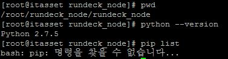
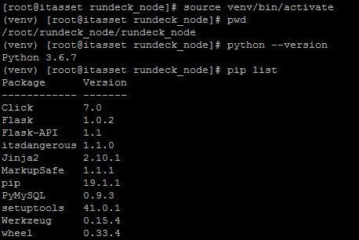
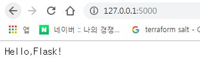
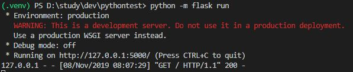
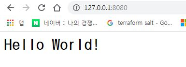
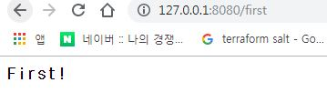
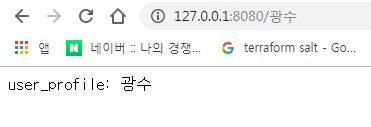

# Python

## 개발 환경 셋팅
---
### 설치
http://www.python.org/downloads 에서 다운로드  
현재(2019.10.30 기준) 3.8.0 (stable)까지 나와 있음  


> PATH 잡아서 설치 하기
> 
---

### pip
Python Package Index(PyPI)에서 제공하는 Python Package를 설치, 관리하는 시스템

```
windows: python -m pip install -U pip 혹은 https://www.lfd.uci.edu/~gohlke/pythonlibs/#pip/
centos: yum install pip
ubuntu: apt-get install python-pip
```
#### 사용법

```bash
# 사용법
pip <pip arguments> 
python -m pip <pip arguments>
```
##### pip 간단한 옵션들
``` bash
# 패키지 설치
pip install <package>
## windows에서 다운로드가 잘 안될 경우
## pip --trusted-host pypi.org --trusted-host files.pythonhosted.org install <package>

# 설치된 패키지 리스트 보기
pip list

# 설치된 패키지를 requirements format으로 출력하기
pip freeze > requirements.txt
# requirements에 있는 패키지 설치하기
pip install -r requirements.txt

# 설치된 패키지의 구체적인 정보 보기
pip show <package>

# 특정 패키지 찾기
pip search <package>

# 패키지 삭제
pip uninstall <package>

# 패키지 dependency check
pip check

# Online 되는 곳에서 해당 패키지를 다운 로드 받음
pip download <package>
# Offline 인 곳에 다운로드 받은 패키지를 옮겨 아래와 같이 실행하여 설치
pip install --no-index --find-links . <package>
```
> https://pip.pypa.io/en/stable/

---

### 가상 환경 구성
virtualenv 혹은 venv(3.4 이후는 기본 설치) 사용  
구동 되었을 때 앞이 *(venv)* 로 변경됨  
> OS와 응용프로그램간의 python version 및 package를 다르게 가져갈 수 있음  
>
|OS의 python version 및 package  |응용프로그램의 python version 및 package |
|---|---|
|  |  |  

* 가상 환경을 구축하여 서로 다른 응용 프로그램간의 영향을 주지 않게 할 수 있음  
(해당 용용 프로그램에 필요한 파이썬이나 패키지를 설치한 데이터 트리를 구성하는 방법)  

> https://virtualenv.pypa.io/en/latest/  
> https://docs.python.org/3/library/venv.html#


#### 설치 (3.5 이상 설치 불필요)
```bash
pip install virtualenv
```
#### 사용법
```bash
# Linux
## 환경 구성
virtualenv ENV
python -m venv .venv
## 동작
source .venv/bin/activate
## 종료
deactivate
```
```powershell
# Windows
## 환경 구성 
python -m venv .venv
## 동작
. .venv\Scripts\activate
## 종료
deactivate
```


---

## Flask를 이용한 API 제작  

Python 기반 Web Framework 로 간단한 API, Web 서비스 제작에 사용  
최신버전: 1.1.1(11/7)  
  
> Flask 공식 Document: https://flask.palletsprojects.com/en/1.1.x/  
> python web framework Rank: https://hotframeworks.com/languages/python  
  
> |웹 프레임워크|설명|  
> |---|---|  
> |Django| 복잡하고 큰 Web Servicing에도 적합, 검증된 framework  |  
> |flask| 간단한 API 제작에 적합한 framework  |  
> |Aiohttp|대규모 처리에 빠른 속도를 보여 최근 뜨고 있는 framework  |  

> Django vs Flask  
> || Django | Flask |  
> |---|---|---|  
> |Type of Framework | Full Stack Web Framework | WSGI Framework |  
> | Flexibility | Feature-packed | Full flexibility |  
> | ORM Usage | Built-in ORM | SQLAlchemy is used|  
> |Design|Batteries-included|Minimalisti design|  
> |Working Style|Monolithic|Diversified|  
>   
> https://data-flair.training/blogs/flask-vs-django/  

---

### Flask 설치  

```bash
pip install flask flask-api
```

---

### 기본 사용법  
  
```python
from flask import Flask     # 1. Flask 모듈 import
app = Flask(__name__)       # 2. app에 Flask 객체 할당

@app.route("/")             # 3. app 객체를 이용하여 routing
def hello():                # 4. 해당 routing 경로, 요청에 맞는 함수 작성
    return "Hello World!"

if __name__ == "__main__":
    app.run(host="127.0.0.1", port="8080")  # 5. Flask 서버 구동을 위한 설정
```
```bash
> python -m flask run
```
  
> 
| Hello world | Server Log |
|---|---|
|  |  |

---
  
  
### 라우팅: 다양한 URL을 연결 하는 방법  
  
```python
from flask import Flask

app = Flask(__name__)

@app.route("/")
@app.route("/hello")        # 여러 디렉토리에 같은 동작도 가능하게함
def hello():
    return "<h1>Hello World!</h1>"

@app.route("/first")        # route 안에 디렉토리를 적어 해당 디렉토리 호출에 맞는 함수 작성
def first():
    return "<h3>First!</h3>"

@app.route("/second")
def second():
    return "Hello Second!"

if __name__ == "__main__":
    app.run(host="127.0.0.1", port="8080")
```

>   
>   
---

### URL을 변수로 활용하기  
  
```python
from flask import Flask

app = Flask(__name__)

@app.route("/")
def hello():
    return "<h1>Hello World!</h1>"

@app.route("/<username>")       # <>안에 값을 받을 변수를 넣어 URL을 통해 값을 받을 수 있음
def user_profile(username):
    return "user_profile: " + username

@app.route("/second/<string:username>") # <타입:변수명> 을 통해 원하는 타입의 변수에 저장 가능 
def second_profile(username):
    return "<h3>Hello" + username + "!</h3>"

if __name__ == "__main__":
    app.run(host="127.0.0.1", port="8080")
```
> 가능한 타입: stirng, int, float, path, uuid

>   
>   
---

### method, code 에 따른 처리 방법  

Flask API를 통해 좀 더 유연하게 API를 제작 가능  
```python
from flask import Flask, request, render_template

app = Flask(__name__)

@app.route("/<string:app>", methods=['PUT','POST']) # request method에 따른 처리
def put(app)
    if request.method == "POST":
        return ~~~
    else:
        return ~~~

@app.route("/<string:app>", methods=['GET'])
def get(app)
    return ~~~~

@app.errorhandler(404)          # 에러 핸들러를 통한 에러처리
def page_not_found(error):
    return render_template('page_not_found.html'), 404

```
  
---
### Web Servicing  
  
실제 production 환경에서는 gunicorn, apache 등의 webservicing application을 이용할 것  
  
#### gunicorn 설치  
  
```bash
pip install gunicorn

gunicorn -b :port번호 --reload 파이썬파일 이름:app 
```
  
## MySQL 연결  
  
python을 이용해 MySQL에 연결할 때에 pymysql, mysql-connector-python, mysqlclient 등의 MySQL adapter들이 있음  
* PyMySQL: python으로 mysql 연결이 가장 간단함  
* mysql-connector-python: oracle mysql 개발팀에서 만듬, 라이선스 이슈가 있음  
* mysqlclient: 가장 빠르지만 mysql-connector-c C 라이브러리가 필요함  

> MySQL adapter benchmark result URL  
> * https://wiki.openstack.org/wiki/PyMySQL_evaluation 
> * http://charlesnagy.info/it/python/python-mysqldb-vs-mysql-connector-query-performance  
> * https://gist.github.com/methane/90ec97dda7fa9c7c4ef1  
  
### 설치  
  
```bash  
python3 -m pip install PyMySQL
python3 -m pip install PyMySQL[rsa]
```  
  
> PyMySQL Docs: https://pymysql.readthedocs.io/en/latest/modules/connections.html  
  
### 기본 사용법  
  
```python
import pymysql          # pymysql 모듈 import

conn=pymysql.connect()  # 1. DB와 연결

curs=conn.cursor()      # 2. cursor 생성

sql = "INSERT ~~~ "
curs.execute(sql)       # 3-1. SQL 실행
curs.commit()           # 3-2. 실행한 SQL DB에 반영

sql = "SELECT ~~~ "
curs.execute(sql)       # 4-1. SQL 실행
res = cursor.fetchall() # 4-2. SQL 결과문 res 변수에 저장

curs.close()            # 5. 사용 완료한 cursor 종료

conn.close()            # 6. DB와 연결 종료
```  
  
### connect  
  
DB와 연결하는 소켓을 나타내는 객체  
  
```python
import pymysql

conn = pymysql.connect(host='****'. port=3306, user='****', passwd='****', db='****', charset='utf8')

conn.commit()               # 현재 transaction commit

conn.cursor()               # 커서 생성

conn.ping(reconnect=True)   # DB 서버가 살아있는지 확인

conn.rollback()             # 현재 transaction Rollback

conn.select_db('test_db2')  # DB 변경

conn.close()                # 연결 종료

```
  
> 자주 사용하는 Parameters  
>  
> |Parameters|설명|default|  
> |---|---|---|  
> |host|DB서버|None|  
> |user|로그인할 사용자|None|  
> |password(passwd)|비밀번호|''|  
> |database(db)|사용할DB|None|  
> |port|MySQL 포트|0|  
> |charset|사용할 charset|''|  
> |autocommit|Autocommit모드|False|  
  
### cursor  
DB에서 상호 통신 하기 위한 객체  
  
> |cursor 종류| 설명 |  
> |---|---|  
> |Cursor| 기본 커서|  
> |SSCursor| 버퍼 없는 기본 커서|  
> |DictCursor|결과값이 Dict() 타입인 커서|  
> |SSDictCursor|버퍼 없는 결과값이 Dict() 타입인 커서|  

```python
curs = conn.cursor()            # 커서 생성
  
curs.execute(query, args=None)  # query 실행, arg 안에 값을 fommating 가능함
  
curs.fetchall()                 # 모든 결과 row fetch
  
curs.fetchone()                 # 다음 결과 row 만 fetch
  
curs.close()                    # 커서 종료
  
```

## Flask - PyMySQL 예제  
  
```python
# index.py
from flask import Flask
import json
import pymysql
from collect import collect

@app.route("/<string:app>", methods=['GET'])
def get_job(app):
	rows = collect.get_job(app)
	return json.dumps(rows)
```  
  
```python
# collect.py
class collect:
	@staticmethod
	def mysql_connect():
		return pymysql.connect(host="****", user="****", passwd="****", db='****')

	@staticmethod
	def get_job(app):
		sql = '''
			SELECT 	DISTINCT job 
			FROM 	jobs
			WHERE	app = %s
		'''
		val = (app)
		return collect.select_query(sql, val)	
```

## Python Configration 파일

### 설정 파일 구조
> main.conf
> ```conf
> [SECTION 1]
> option1 = value
> option2 = value
>
> [SECTION 2]
> option1 = value
> option2 = value
> ```

### 사용법
```python
import configparser

config = configparser.ConfigParser()
config.read('/ConfigFileLocation/main.conf')

section1 = config['SECTION 1']
sec1opt1 = section1['option1']

section2 = config['SECTION 2']
```